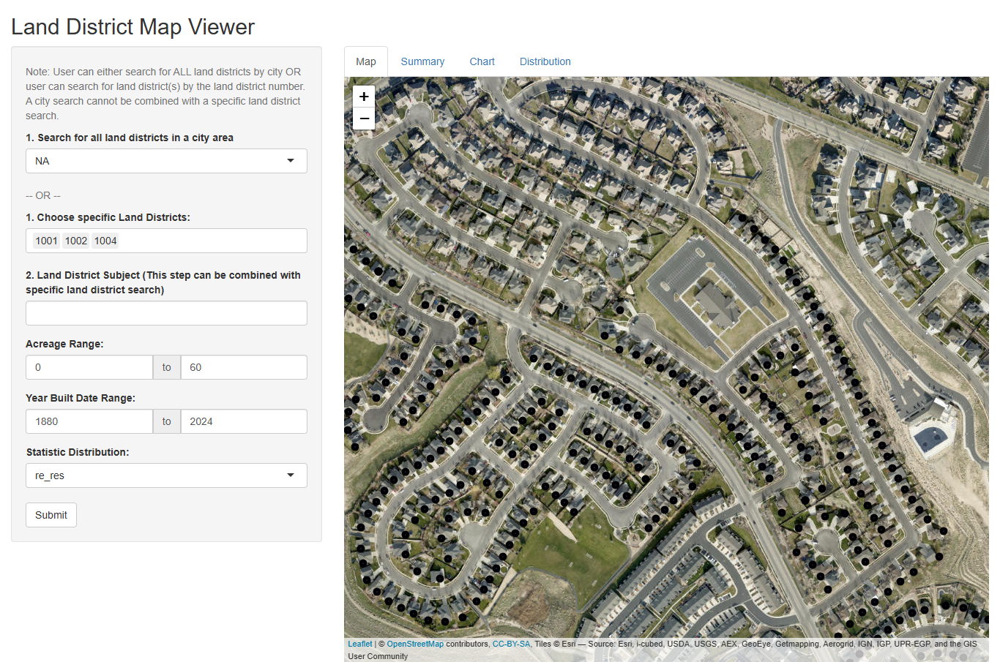

The Land District App was developed to provide a comprehensive and interactive view of various land districts in Utah County. With this map, a user can easily explore parcels based on city or individual land district, or even groups of land districts. Additionally, the app allows you to filter land districts based on acreage, year built, and statistical distribution.

![][2]

